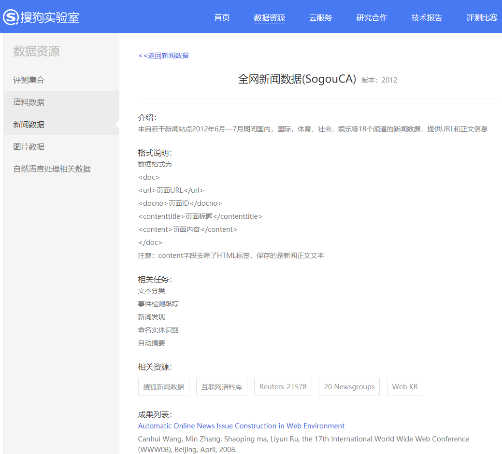
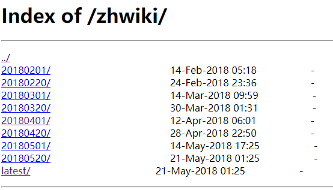
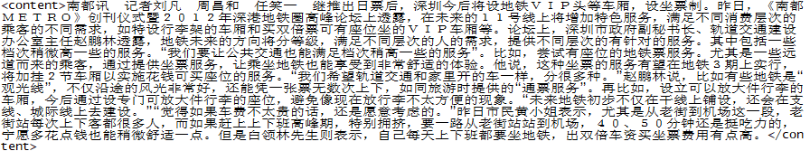

# Get And Process Your Corpus

所谓**语料(corpus)**，就是我们输入的数据，机器学习本质上是一个数据的科学，因此数据的好坏决定了机器学习的效果如果，因此也可以说语料的好坏决定了聊天机器人的好坏。

如果想实现一个英文的聊天机器人，那么恭喜，我们还是能在网络上找到很多优质的语料的，但是很可惜在中文世界中高质量的语料库很少。

然而即使我们拿到了语料，其实也还无法立即开始工作，原始的语料很少能够直接拿来进行训练，我们还需要做许多工作才能利用机器学习训练我们的模型，比如分词，去停用词，去标点符号，添加标签。

因此在这篇文中我们将会解决两个问题：

- 获取语料
- 处理语料

## 1. 获取语料

### 1.1  [搜狗语料库](http://www.sogou.com/labs/resource/list_yuliao.php)



提供了许多NLP领域很有用的数据集，我一般用全网新闻数据训练词向量。考虑到互联网世界数据量实在太大，对于那些压缩后依然接近大小可观的数据，他们还提供了邮寄硬盘去拷贝的服务……不过在这个项目中，我们用全网新闻数据或搜狐新闻数据就够了。

### 1.2  [中文维基语料库](https://dumps.wikimedia.org/zhwiki)



大名鼎鼎的维基百科，我们可以下载 latest 目录下的 zhwiki-latest-pages-articles.xml.bz2。这个压缩包中的文件包含标题、正文部分。使用这个语料库的一个优势是，网上有许多解析维基百科的工具，这意味着我们可以省很多事。

上面就是我经常使用的两个语料库，一般我都是用这些语料库做词向量的训练。

### 1.3 对白语料

如果是训练一个问答机器人，我们还是需要一些问题的语料，这个时候我们可以求助万能的github，只要细心寻找，总能发现一些惊喜，比如这个项目：

<https://github.com/candlewill/Dialog_Corpus>

包含了用于人机对话训练的语料，像小黄鸡的语料，机器人对话的语料都算是质量比较高的了。

另外一个推荐的项目是

<https://github.com/Samurais/insuranceqa-corpus-zh>

 是一个保险行业的语料库，包含已经处理过的问答对数据与未经处理的问答数据，如果想做一个保险行业的聊天机器人，这是一个很好的语料库。

## 2. 语料预处理

### 2.1 提取文本

之前提到了，我们在网上找到的原始语料是无法直接拿来使用的，必须要经过分词，去除标点，停用词等处理，这些处理的详细介绍可以查看其它文章。

我下载的搜狗新闻语料包大小在640MB左右，解压后是一个dat格式的文件，数据的组织结构为

```xml
<doc>
<url>页面URL</url>
<docno>页面ID</docno>
<contenttitle>页面标题</contenttitle>
<content>页面内容</content>
</doc>
```

原始的语料数据是GBK格式的，在linux上是乱码，需要将其转换为UTF-8编码，顺带的我们也只需要`<content>`标签内的内容，因此可以一并将其处理了。

可以执行以下shell命令：

```shell
cat news_tensite_xml.dat | iconv -f gbk -t utf-8 -c | grep "<content>"  > sougou_corpus.txt 
```

经过处理的语料只会用如下：



